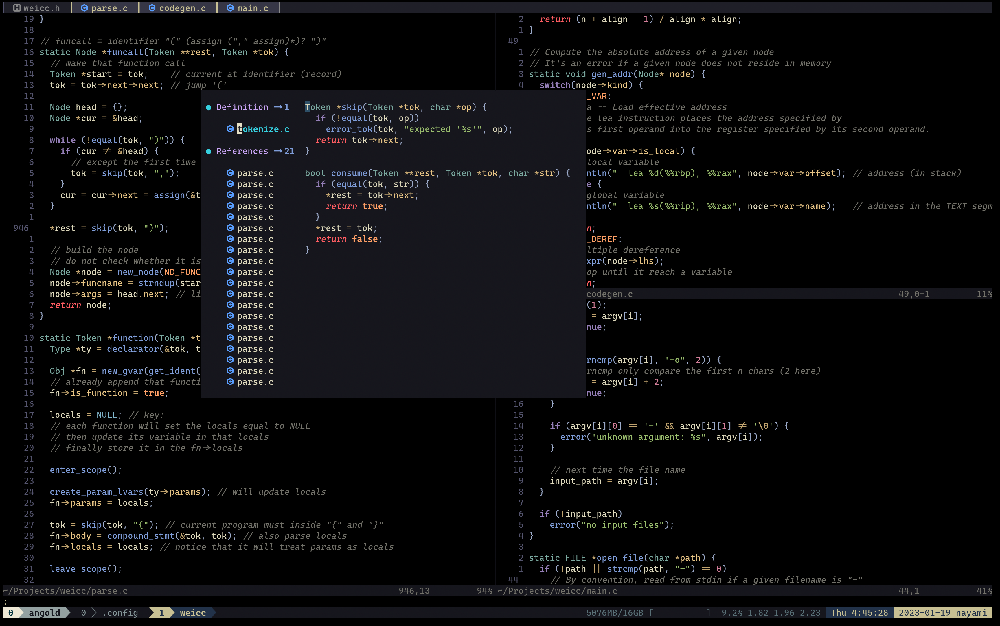
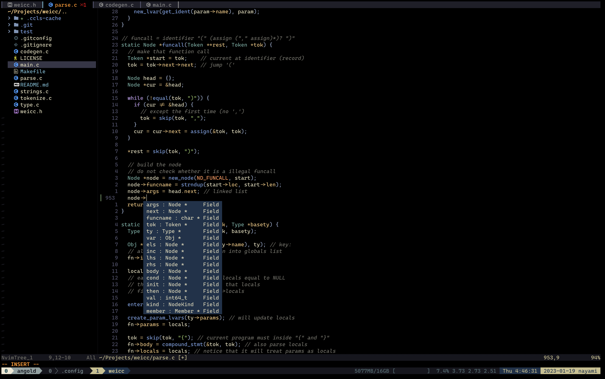
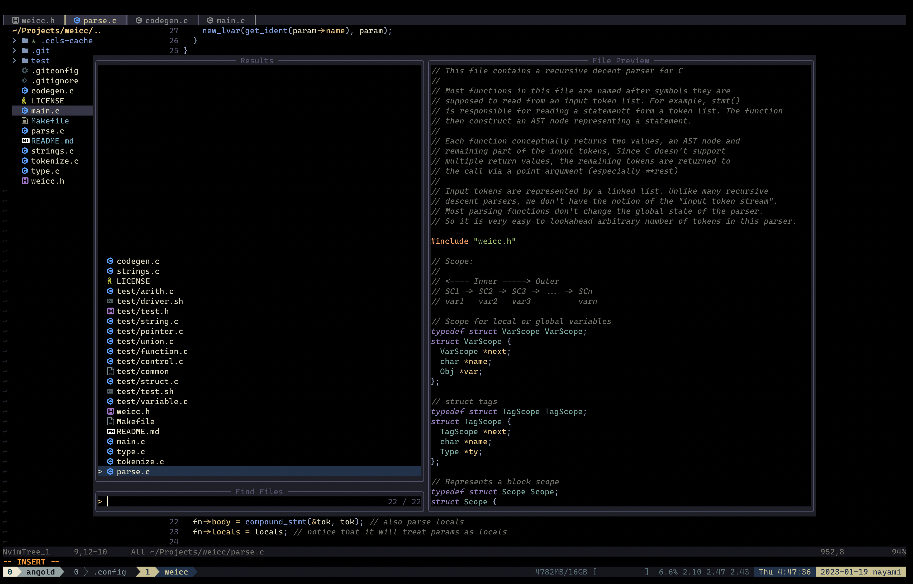
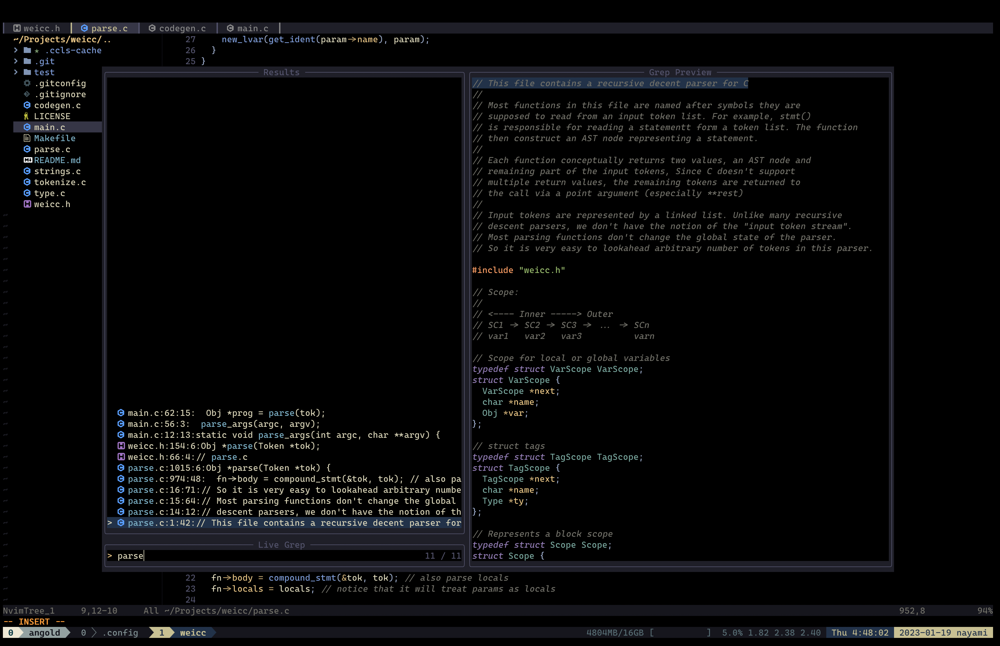

# .config

Personal configuration files (e,g, neovim, tmux, fish)

## Screenshots:

### [lspsaga](https://github.com/glepnir/lspsaga.nvim) [lsp-config](https://github.com/neovim/nvim-lspconfig)

### [nvim-cmp](https://github.com/hrsh7th/nvim-cmp)

### [telescope](https://github.com/nvim-telescope/telescope.nvim)

